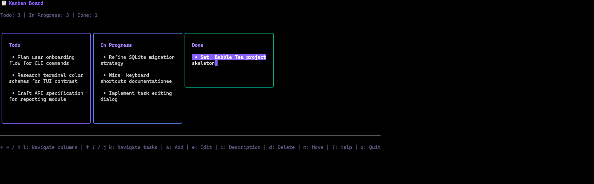

# cli_kanban (Python)



A terminal-based Kanban board management tool built with Python, featuring a beautiful TUI interface.

## Features

- 📋 **Three-column board**: Todo / In Progress / Done
- ✨ **Full CRUD operations**: Add, edit, and delete tasks
- 🎨 **Beautiful TUI interface**: Built with ANSI colors
- 💾 **SQLite persistence**: Data automatically saved to local database
- ⌨️ **Keyboard shortcuts**: Efficient keyboard navigation

## Installation

### Prerequisites

- Python 3.8 or higher
- pip (Python package manager)

### Setup

```bash
# Clone or navigate to project directory
cd cli_kanban_python

# Install dependencies
pip install -r requirements.txt

# Run
python main.py
```

## Usage

### Launch Application

```bash
# Use default database path (~/.cli_kanban.db)
python main.py

# Specify custom database path
python main.py --db /path/to/kanban.db
```

### Keyboard Shortcuts

**Navigation:**
- `← →` or `h l`: Move between columns
- `↑ ↓` or `j k`: Move between tasks

**Actions:**
- `a`: Add new task to current column
- `e` or `Enter`: Edit selected task title
- `i`: Edit selected task description
- `t`: Edit selected task tags
- `d` or `Delete`: Delete selected task
- `m`: Move task to next column

**Other:**
- `?`: Show help
- `q` or `Ctrl+C`: Quit application
- `Esc`: Cancel current action or quit

## Running Tests

To verify the installation and run the test suite:

```bash
python test_cli_kanban.py
```

## Project Structure

```
cli_kanban_python/
├── main.py                 # Main entry point
├── requirements.txt        # Python dependencies
├── README.md              # This file
└── cli_kanban/
    ├── __init__.py        # Package initialization
    ├── db/
    │   ├── __init__.py
    │   └── sqlite.py      # SQLite database implementation
    ├── model/
    │   ├── __init__.py
    │   └── task.py        # Task and column models
    └── tui/
        ├── __init__.py
        ├── model.py       # TUI model and state
        ├── update.py      # Input handling
        └── view.py        # View rendering
```

## Implementation Notes

This is a Python port of the Go CLI Kanban application with the following details:

### Database Layer
- Uses SQLite for data persistence
- Supports task CRUD operations
- Maintains relationships between tasks and columns via status
- Tags are stored as comma-separated strings

### TUI Layer
- Pure Python implementation using ANSI color codes
- Terminal rendering with support for:
  - Column-based layout
  - Task scrolling
  - Multi-mode views (add, edit, delete, help)
- Input handling via raw terminal or curses (Unix) / raw mode (Windows)
- Real-time task updates

### Model Layer
- Task data structure with id, title, description, tags, status, timestamps
- Column representation with task collections
- Task status workflow: TODO → IN_PROGRESS → DONE

## Differences from Go Version

1. **Terminal Handling**: Uses Python's built-in curses (Unix) or raw terminal mode
2. **Rendering**: ANSI color codes instead of Bubble Tea framework
3. **Input Handling**: Simple event loop instead of Bubble Tea's architecture
4. **Database**: Standard sqlite3 module instead of go-sqlite3

## License

Same as the original Go project.
